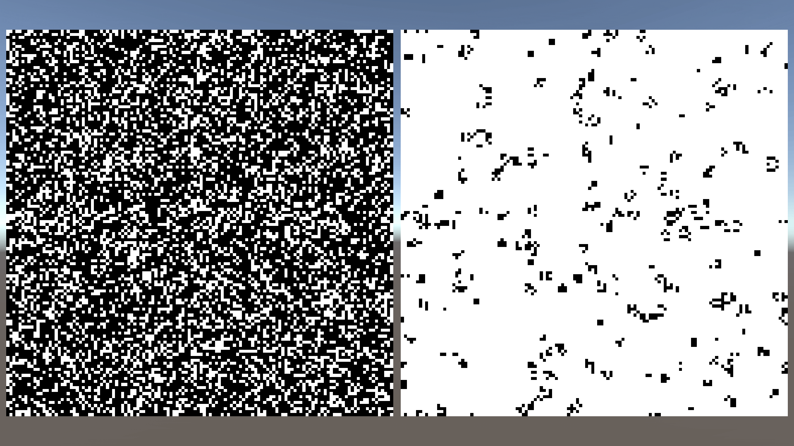
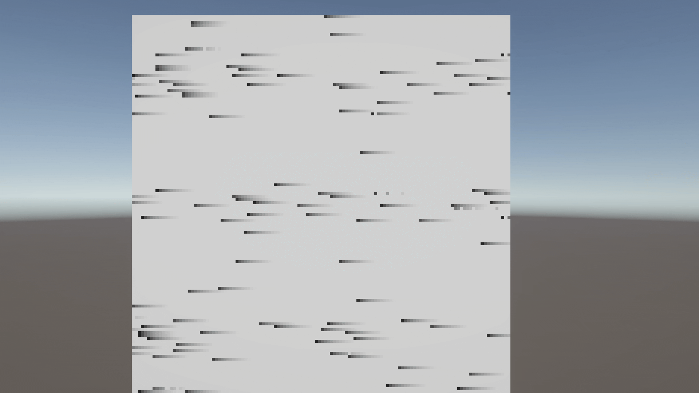

# カスタムレンダーテクスチャ

## はじめに

プログラムワークショップⅣの管理用です

## 結果画像

### ライフゲーム

### Curl noise

### あなたの考えた素敵なシェーダー

- 工夫した点
  - 前のフレームをみて、ノイズの点が残留して見えるようにしました

## 進め方

- 本リポジトリ (tpu-game-2025/PGWS4_11_custom_rendertexture)をforkしてください
- fork先のリポジトリを更新してください
- Unityのプロジェクトをsrc内で進めてください
- 結果を画面キャプチャして、画像としてリポジトリに追加して、上記のリンクから見られるようにしてください
- 完成したら本リポジトリのmainブランチにpull requestを投げてください
